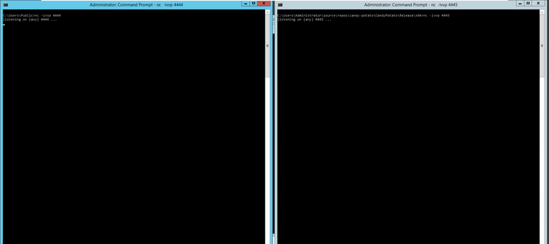

# Candy Potato (Caramelized Juicy Potato)
*Version 0.2 of [JuicyPotato][1]. In comparison with version 0.1 (JuicyPotato), this version offers some improvements, such as automating the exploitation.*

## Overview

This tool has been made on top of the original [JuicyPotato][1], with the main focus on improving/adding some functionalities which was lacking. 
It is known to work against both Windows Workstation and Server versions up to 8.1 and Server 2016, respectively. 

## Summary
[JuicyPotato][1] leverages the privilege escalation chain based on certain COM Servers, using a MiTM listener hosted on `127.0.0.1`, and it works when you have `SeImpersonate` or `SeAssignPrimaryToken` privileges. 
By default, [JuicyPotato][1] uses the `BITS` service CLSID, and provides other tools (a set of PowerShell and Batch scripts), to enumerate and test other CLSIDs. 

Although in combination these tools actually do a fantastic job, I've soon realized during my tests that they present some drawbacks:

* Multiple executable files to be uploaded on the target machines
* Multiple data files to be created during the CLSID gathering
* General lack of speed due to this multistep process

The "weakest" point is that different Windows Versions, as well as different configurations often requires to enumerate available CLSID over the target machine and that "try" them, one by one.

I decided then to automate this process in a new version of [JuicyPotato][1], that is **Candy Potato**.

> For additional information, I suggest seeing the original [JuicyPotato][1] repository, and follow the references.

## Candy details

For backward compatibility, CandyPotato allows you to do whatever you could with [JuicyPotato][1]:

### New Commands

+ **INFO mode**<br>
_Enumerate suitable CLSIDs and print them back to the user, improving what GetCLSID.ps1 used to do in JuicyPotato v0.1_

+ **AUTO mode**<br>
_Automatically enumerate suitable CLSIDs and try to exploit them_

+ **Service StartType**<br>
_Filter CLSIDs basing on the Service Start Type (Manual, Auto, Disabled, etc) permitting to minimize failures_

#### Old Commands

+ **Target CLSID**<br>
_Pick any CLSID you want. In the old [JuicyPotato Repository](CLSID/README.md) you can find the list organized by OS. (**Deprecated**: Use -Q to discover available CLSIDs)_

+ **COM Listening port**<br>
_define COM listening port you prefer (default 10000)_

+ **COM Listening IP address**<br>
_bind the server on any IP_

+ **Process creation mode**
<br>_depending on the impersonated user's privileges you can choose from:_  
    - `CreateProcessWithToken` (needs `SeImpersonate`)
    - `CreateProcessAsUser` (needs `SeAssignPrimaryToken`)
    - `both`

+ **Process to launch**<br>
_launch an executable or script if the exploitation succeeds_

+ **Process Argument**<br>
_customize the launched process arguments_

+ **RPC Server address**<br>
_for a stealthy approach you can authenticate to an external RPC server_

+ **RPC Server port**<br>
_useful if you want to authenticate to an external server and firewall is blocking port `135`..._

+ **TEST mode**<br>
_mainly for testing purposes, i.e. testing CLSIDs. It creates the DCOM and prints the user of token._

## Usage

```
T:\>CandyPotato.exe
CandyPotato v0.2

Mandatory args:
-t createprocess call: <t> CreateProcessWithTokenW, <u> CreateProcessAsUser, <*> try both
-p <program>: program to launch

Optional args:
-l <port>: COM server listen port (default 10000)
-m <ip>: COM server listen address (default 127.0.0.1)
-a <argument>: command line argument to pass to program (default NULL)
-k <ip>: RPC server ip address (default 127.0.0.1)
-n <port>: RPC server listen port (default 135)
-c <{clsid}>: CLSID (default BITS:{4991d34b-80a1-4291-83b6-3328366b9097})
-z only test CLSID and print token's user
-x automatically identifies suitable CLSIDs and attempt exploitation
-s <start-type> [1-4](default 3:[MANUAL])
-Q print available CLSIDs and exit
```

## Example


## Considerations

This exploit has been "randomly" mitigated by Microsoft in a completed unrelated update affecting Oxid Resolvers. The full story, and a new exploit ("RoguePotato") capable to bypass the unintended mitigation, can be found at the following addresses:

* [No more JuicyPotato? Old story, welcome RoguePotato!][3]
* [RoguePotato][2]

## Author
- [d3adc0de](https://twitter.com/klezVirus)
 
## Credits (JuicyPotato v0.1)

Awesome work done by @decoder-it (decoder_it) and @ohpe (Giutro) on the original Juicy-Potato:
- [Andrea Pierini](https://twitter.com/decoder_it)
- [Giuseppe Trotta](https://twitter.com/Giutro)

Also I would like to take a moment to say a "Thanks" to @AntonioCoco for the work on [RoguePotato][2]: 
- [Antonio Coco](https://twitter.com/splinter_code)

These guys are amazing.

## References

* [Juicy Potato (abusing the golden privileges)][1]
* [No more JuicyPotato? Old story, welcome RoguePotato!][3]
* [Potatoes and Tokens](https://decoder.cloud/2018/01/13/potato-and-tokens/)
* [Social Engineering the Windows Kernel by James Forshaw](https://www.slideshare.net/Shakacon/social-engineering-the-windows-kernel-by-james-forshaw)

[1]: https://github.com/ohpe/juicy-potato
[2]: https://github.com/antonioCoco/RoguePotato
[3]: https://decoder.cloud/2020/05/11/no-more-juicypotato-old-story-welcome-roguepotato/
